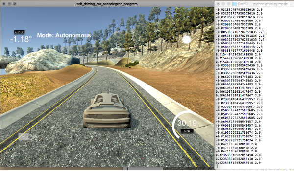

## Behavioral Cloning Project

### Self Driving Car

The goal of this project is to train a deep neural network drive the car autonomously around a simulated around a test track in Udacity's driving simulator. The trained model try to predict right steering angles. The network is trained on from a video stream that was recorded while a human was steering the car. The CNN thus clones the human driving behavior.

#### The goals / steps of this project are the following:

* Use the simulator to collect data of good driving behavior
* Build, a convolution neural network in Keras that predicts steering angles from images
* Train and validate the model with a training and validation set
* Test that the model successfully drives around track one without leaving the road
* Summarize the results with a written report

Please see the [rubric points](https://review.udacity.com/#!/rubrics/432/view) points for this project.

### Requirements and Installations
#### Installations

* Install Miniconda with Python 3.6 and Udacity's carnd-term1 conda environment https://github.com/udacity/CarND-Term1-Starter-Kit/blob/master/doc/configure_via_anaconda.md
* CarND-Term1-Starter kit git clone https://github.com/udacity/CarND-Term1-Starter-Kit.git
* Create carnd-term1 Environment: conda env create -f environment.yml

Behavioral environment
*git clone https://github.com/ncondo/CarND-Behavioral-Cloning

cd CarND-Term1-Starter-Kit

Download Udacity's sample data and save it in the same directory as model.py
* Dataset https://d17h27t6h515a5.cloudfront.net/topher/2016/December/584f6edd_data/data.zip
Download Udacity's driving simulator
* https://github.com/udacity/self-driving-car-sim

### Simulator
#### Collecting Data
* Open simulator in training mode
* Run view laps clockwise and counterclockwise
* record some recovery shots (back to road)

#### Testing your model
* open another shell in that directory where is your model.h5 and type
* python drive.py model.h5

### Evironment
Create an environment for this projects:
* conda env create -f environment.yml

After the environment is created, it needs to be activated.

* source activate carnd-term1 Open Jupyter notebook
* jupyter notebook

To train the model, first make a directory ./data/mydata, drive the car in training mode around the track and save the data to this directory. The model is then trained by typing
* python model.py

### Files and Usage
model.py
* Contains all code for reading in training data and training a model to predict steering angles.
drive.py
* for driving the car in autonomous mode
* Contains code to serve predictions from a trained model to Udacity's simulator for autonomous driving.
model.h5
* containing a trained convolution neural network
* containing model weights
writeup_report.md
* explain the structure of my network and training approach

## Model Architecture and Training Strategy

### 1. Solution Design Approach
* CarND (lecture example)
* Lenet
* nVidia
* Comma.ai

I first experimented with various different Network structures with a small amount of self-stored data to make the experiments faster and make the effects easier to see.

I tried the basic structure described in the course, then the Lenet structure, nVidian, and Comma.ai variations. Some trials got stuck in my machine, especially if I used too much data to train.
Eventually I ended up using the Comma.ai design because it work smooth and I got the car to stay on track pretty well.

LeNet:

nVidia model: 

### 2. Final Model Architecture
The final model architecture (model.py lines 76-89) consisted of a convolution neural network with the following layers and layer sizes:

Model architechture (comma.ai)

| Layer (type)         | Output Shape           | Param no  |
| ------------- |:-------------:| -----:|
| Lamda_1      | None, 16, 32, 1) | 0 |
| convolution2d    | (None, 4, 8, 16) |  1040|
| convolution2d | (None, 2, 4, 32)    |   12832 |
| convolution2d      | None, 1, 2, 64) | 51264 |
| Flatten    | (None, 128)     |  0|
| Dropout | (None, 128)    |   0 |
| ELU 1     | None, 128) | 0 |
| Dense    | (None, 512)     |  66048|
| Dropout | (None, 512)    |   0 |
| ELU 2     | None, 512) | 0 |
| Dense    | (None, 1)     | 513|

Total params: 131 697 Train on 40983 samples, validate on 7232 samples loss: 0.0120 val_loss: 0.0124

### 3. Creation of the Training Set & Training Process
#### Running the Simulation

To capture good driving behavior, I first recorded couple of laps on track one using center lane driving. Here is an example image of center lane driving:

#### Data Collection

I then recorded the vehicle recovering from the left side and right sides of the road back to center so that the vehicle would learn to to return to the track after having left the route. These images show what a recovery looks like:

I also run the track in the opposite direction, so that there would be steering angle-data equally in both directions.
Then I repeated this process on track two in order to get more data points.
For comparison, I also used the training data provided by Udacity. The final model is trained by the data provided by Udacity.

### Training the Network
First, I did the tests with the little training data to make it faster and finally with full data.

Images of all three cameras are used in the training. Side views help the model learn how to recover when the vehicle drives off the center the lane. Steering angle value is get by trial and error. Apparently a better way would be applying Ackerman geometry to calculate proper recover steering angles.

I had trouble getting the generator to work well so I tried to make the data used as lightweight as possible so that it could work directly in memory. Training worked pretty fast and the code was clear.

#### Data Preprosessing
Images have been converted to HSV color space and only the S channel is used. The extra parts have been removed from the pictures and have been changed to a smaller size (16,32,1).

#### Data Augementation
To balance the data, all the images and steering angles have been flipped and added to the training set. This balances data because it makes egual number turns to both sides (left/right). For example, here is an image that has then been flipped:

Original image 

Flipped image

HSV image (S-channel) 

### Validating the Network (+Epochs)

I finally randomly shuffled the data set and put 15% of the data into a validation set.

I used this training data for training the model. The ideal number of epochs was 20-25 with model checkpoint and early stopping. I used an adam optimizer so that manually training the learning rate wasn't necessary.

Validating the Data

15% of the data was selected for the validation set. Be sure to randomly shuffle the data before splitting into training and validation sets. The validation set helped determine if the model was over or under fitting.

If model predictions are poor on both the training and validation set (for example, mean squared error is high on both), then this is evidence of underfitting. Possible solutions could be to increase the number of epochs add more convolutions to the network.

When the model predicts well on the training set but poorly on the validation set (for example, low mean squared error for training set, high mean squared error for validation set), this is evidence of overfitting.

If the model is overfitting, a few ideas could be to use dropout or pooling layers use fewer convolution or fewer fully connected layers collect more data or further augment the data set

Ideally, the model will make good predictions on both the training and validation sets. The implication is that when the network sees an image, it can successfully predict what angle was being driven at that moment.

### Conclusions
In the future could compare the results using a more accurate image quality and a keros generator.
Larger data set and more versatile use of augmented material (shadows, brightnes,etc) would likely improve the results.
